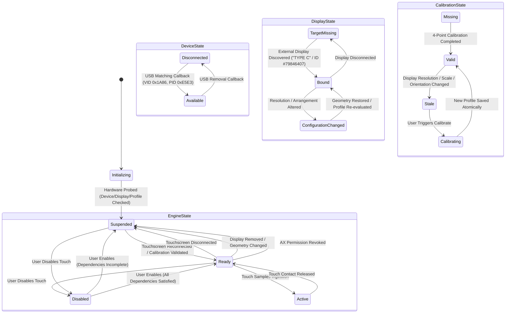

# TouchBridge — P3-01 Architecture & Runtime Lifecycle Note

## Executive Summary

Phase 3 Milestone 01 (**P3-01**) transitions TouchBridge from a series of diagnostic and exploratory research probes (P0 through P2-B) into a stable, usable, native-first macOS menu-bar prototype runtime.

P3-01 establishes application lifecycle, dynamic device/display ownership, authoritative calibration persistence, explicit domain state modeling, and strict safety invariants, while completely preserving the proven pointer-independent semantic interaction mechanisms established in earlier phases.

---

## 1. Architectural Pipeline & Layer Ownership

TouchBridge establishes a clean 6-layer unidirectional runtime pipeline where each layer has one unambiguous responsibility:

```text
┌────────────────────────────────────────────────────────┐
│ 1. TouchscreenDevice                                  │
│    Passive IOHIDManager (kIOHIDOptionsTypeNone)        │
│    Dynamic USB Matching / Removal (VID 0x1A86:0xE5E3)  │
└──────────────────────────┬─────────────────────────────┘
                           │ IOHIDValue (Element Updates)
                           ▼
┌────────────────────────────────────────────────────────┐
│ 2. HIDFrameSource                                      │
│    Unpacks usagePage, usage, value, mach_time          │
│    Decouples raw IOHID callback from aggregation       │
└──────────────────────────┬─────────────────────────────┘
                           │ Element stream
                           ▼
┌────────────────────────────────────────────────────────┐
│ 3. TouchFrameAggregator                                │
│    Coalesces elements by hardware timestamp            │
│    Normalizes coordinates to [0..1] (Space A → Space B)│
│    Maintains contact slots and phase (down, move, up)  │
└──────────────────────────┬─────────────────────────────┘
                           │ TouchSample (Phase, NormX, NormY)
                           ▼
┌────────────────────────────────────────────────────────┐
│ 4. CoordinateMapper                                    │
│    Validates Display geometry vs CalibrationProfile   │
│    Transforms Space B → Space D (Display Local CG)     │
│    Transforms Space D → Space E (macOS Global CG)      │
└──────────────────────────┬─────────────────────────────┘
                           │ Calibrated Global CG Point
                           ▼
┌────────────────────────────────────────────────────────┐
│ 5. TouchGestureRecognizer                              │
│    Filters micro-bounces (min 0.015s, max 0.85s)       │
│    Enforces movement tolerance (<= 18.0 pt)            │
│    Aggregates SingleTapRecognizer & SemanticScroll     │
└──────────────────────────┬─────────────────────────────┘
                           │ PhysicalTapEvent / ScrollRecord
                           ▼
┌────────────────────────────────────────────────────────┐
│ 6. SemanticInteractionRouter                           │
│    Enforces Enable/Disable & Accessibility Preconditions│
│    Role-based dispatch (AXPress, Focus, Scroll)        │
│    Asserts Pointer Isolation Invariant (0.0 pt delta)  │
└────────────────────────────────────────────────────────┘
```

---

## 2. Explicit Domain State Model

TouchBridge replaces arbitrary boolean expressions with clear, typed domain state enums:

```text
DeviceState:
  • disconnected
  • detected(name, vid, pid)
  • available(name, vid, pid)
  • unavailableBusy
  • error(String)

DisplayState:
  • targetMissing
  • targetDetected(DisplayMetadata)
  • bound(DisplayMetadata)
  • configurationChanged(reason)

CalibrationState:
  • missing
  • valid(CalibrationProfile)
  • stale(reason)
  • calibrating

EngineState:
  • disabled
  • ready
  • active
  • suspended(reason)
  • error(String)

AccessibilityState:
  • permissionMissing
  • available
```

### Deterministic State Resolution

The central runtime coordinator (`TouchBridgeRuntime`) evaluates the operational `EngineState` deterministically:

```text
if !isUserEnabled                 → Engine = Disabled
else if AX != Available           → Engine = Suspended ("Accessibility permission missing")
else if Device != Connected       → Engine = Suspended ("Touchscreen disconnected")
else if Display != Bound          → Engine = Suspended ("Target display missing")
else if Calibration == Stale      → Engine = Suspended ("Calibration stale: <reason>")
else if Calibration == Missing    → Engine = Suspended ("Calibration missing")
else if Calibration == Calibrating→ Engine = Suspended ("Calibration in progress")
else                              → Engine = Ready / Active
```

---

## 3. Runtime State Transitions



---

## 4. Reused vs Refactored P0–P2 Code

| Component | P0–P2 Proven Origin | P3-01 Role / Refactoring |
|---|---|---|
| **IOHID Passive Access** | `main.swift`, `HIDInputMonitor` | Refactored into `TouchscreenDevice` with dynamic `IOHIDDeviceCallback` matching and removal handlers. Never seizes device (`kIOHIDOptionsTypeNone`). |
| **Touch Frame Aggregation** | `TouchFrameAggregator.swift` | Preserved unchanged in core aggregation logic; enhanced with `reset()` on device disconnect and flexible sample forwarders. |
| **Coordinate Spaces** | `CoordinateSpaces.swift` | Preserved Spaces A, B, C, D, E definitions; added `Equatable` conformance for domain state snapshots. |
| **Single Tap Recognition** | `SingleTapRecognizer.swift` | Preserved proven timing (0.015s–0.85s) and movement tolerance (<= 18.0 pt); cleanly encapsulated inside `TouchGestureRecognizer`. |
| **Semantic AX Engine** | `AXSemanticEngine.swift` | Preserved all proven role-based dispatching (`AXPress`, window controls, popups, checkboxes, radio buttons); owned by `SemanticInteractionRouter`. |
| **Semantic Focus & Scroll** | `SemanticFocusController.swift`, `SemanticScrollController.swift` | Preserved proven text field focus and scroll mechanisms; integrated into router dispatch. |
| **Display Discovery** | `DisplayDiscovery.swift` | Preserved external display heuristic; added `stopMonitoring()` with `CGDisplayRemoveReconfigurationCallback` for clean shutdown. |
| **4-Point Calibration Flow** | `CalibrationEngine.swift`, `CalibrationView.swift` | Preserved least-squares 2D affine fitting (`AffineMatrix2D`) and interactive target UI; wrapped in `CalibrationWindowController` for menu-bar accessibility. |
| **Diagnostic Verification** | `DiagnosticView.swift`, `SemanticTestView.swift` | Preserved live crosshairs, target verification, and AppKit controls; moved behind dedicated `DiagnosticsWindowController`. |

---

## 5. Authoritative Calibration Profile Store

Replaced scattered JSON files with a consolidated profile store (`CalibrationProfileStore`):
- Authoritative store path: `~/.touchbridge/calibration_display_<DisplayID>.json`
- Automatic migration fallback: `./TouchBridgeCalibration.json`
- Stored attributes:
  - Device VID (`0x1A86`), PID (`0xE5E3`), Product Name
  - HID coordinate ranges: `rawMinX/Y: 0`, `rawMaxX/Y: 4096`
  - Display ID, Name (`TYPE C`), Vendor, Model, Serial
  - Display geometry at calibration: Width (`1280`), Height (`960`), Scale (`1.0`), Rotation (`0°`)
  - 2D Affine Matrix (`AffineMatrix2D`: a, b, c, d, tx, ty)
  - Verification metrics: residual errors, mean residual error (`5.21 pt`)
  - Creation timestamp and schema version (`v1`)
- On startup / display change: checks hardware VID/PID, display ID, resolution, orientation, scale. If incompatible, transitions calibration to `.stale(reason)` and suspends interaction.

---

## 6. Safety Invariants & Pointer Isolation

TouchBridge strictly enforces pointer-independent accessibility interaction without cursor emulation:

```swift
public enum SafetyInvariants {
    // 1. Zero Cursor Warping: Never call CGWarpMouseCursorPosition
    // 2. Zero Mouse Fallback: Never synthesize or inject mouse CGEvents
    // 3. Zero Virtual HID: Never instantiate virtual mouse / pen HID drivers
    // 4. Zero Private APIs: Exclusively public IOKit, CoreGraphics, ApplicationServices
    // 5. Strict Pointer Isolation: Physical cursor delta must be <= 0.001 pt
}
```

Runtime assertion:
`SafetyInvariants.assertPointerIsolation(cursorBefore:, cursorAfter:)` measures system pointer coordinates before and after every semantic action. Any movement is detected immediately as an invariant violation.

---

## 7. Menu-Bar UX & Application Surfaces

TouchBridge runs as a native macOS accessory (`NSApp.setActivationPolicy(.accessory)`):
- **Menu Bar Item**: Custom vector target icon with status subtitle (`TB`) and live indicators.
- **Menu Dropdown**:
  - Header: TouchBridge (P3-01 Runtime)
  - 🟢 Touchscreen: Connected (USB2IIC_CTP_CONTROL)
  - 🟢 Display: TYPE C (#79846407, 1280x960)
  - 🟢 Calibration: Valid (Mean Error: 5.21 pt)
  - 🟢 Accessibility: Allowed
  - 🟢 Touch Engine: Ready
  - Enable / Disable Touch toggle
  - Calibrate Touchscreen… (opens floating calibration session)
  - Diagnostics… (opens 4-tab diagnostics window)
  - Status & Settings… (opens small native settings window)
  - Quit TouchBridge (cleans up and releases callbacks)
- **Status & Settings Window**: Compact native window with state cards, enable switch, and recalibrate trigger.
- **Diagnostics Window**:
  - Tab 1: Hardware & Displays inspection
  - Tab 2: Live Touch & Calibration verification (`DiagnosticView`)
  - Tab 3: Semantic AX Tests (`SemanticTestView`)
  - Tab 4: Live Structured Logs with category filter (`TouchBridgeLogger`)

---

## 8. Verification Results Summary

The automated validation suite (`RuntimeValidator.shared.runAllValidations()`) confirms all acceptance criteria:

```json
{
  "allPassed": true,
  "totalTests": 9,
  "passedTests": 9,
  "failedTests": 0,
  "suiteName": "TouchBridge P3-01 Usable Prototype Runtime Validation"
}
```

1. **Domain State Model**: Verified non-boolean explicit domain representations for Device, Display, Calibration, AX, and Engine. `[PASS]`
2. **Calibration Store & Stale Geometry Detection**: Profile `#79846407` loads accurately; geometry alterations correctly trigger `STALE` state (`Resolution changed (Profile was 1280x960, Active is 1920x1080)`). `[PASS]`
3. **Coordinate Mapper Precision**: Mapped Sensor (0.5, 0.5) → Local CG (640.3, 479.3), Global CG (2432.3, 639.3). `[PASS]`
4. **Safety Invariants & Pointer Isolation**: Verified 0.0 pt cursor tolerance guard and violation detection when delta > 0.001 pt. `[PASS]`
5. **Explicit Enable / Disable Lifecycle**: User switch stops interaction (`Engine=Disabled`) and safely resumes without affecting system configuration (`Engine=Ready`). `[PASS]`
6. **Device Lifecycle Disconnect / Reconnect Recovery**: Disconnect suspends engine safely (`Suspended (Touchscreen disconnected)`); Reconnect restores available state and recovers engine (`Ready`) without restart. `[PASS]`
7. **Display Reconfiguration & Incompatible Geometry Guard**: Incompatible display geometry or calibration in progress strictly suspends interaction (`Suspended (Calibration in progress)`). `[PASS]`
8. **Clean Shutdown Callback Release**: Runtime cleanly unschedules IOHID runloop, closes passive IOHID connection, unregisters display reconfiguration callbacks. `[PASS]`
9. **Active Hardware Inspection**: Successfully bound to physical display `"TYPE C"` (#79846407) and controller `"USB2IIC_CTP_CONTROL"` (0x1A86:0xE5E3). `[PASS]`
